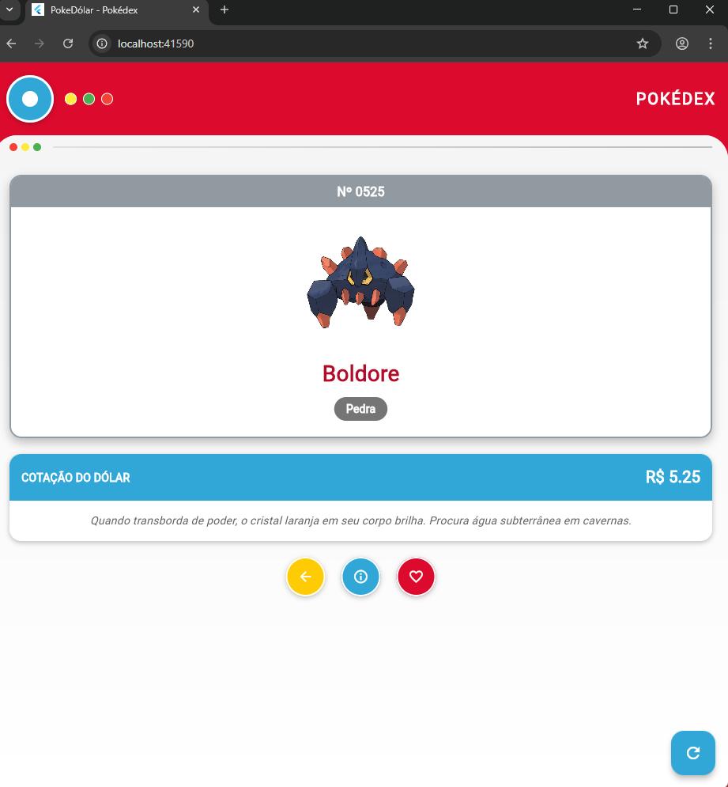
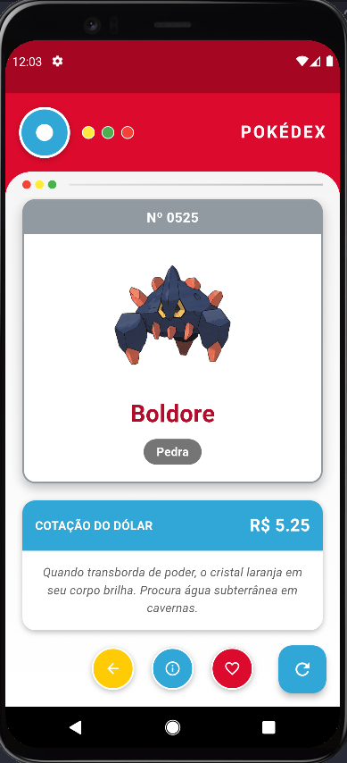

# 💰 PokeDólar - Pokédex da Cotação

[](https://flutter.dev)
[](https://opensource.org/licenses/MIT)

Um aplicativo Flutter inovador que combina economia e diversão! O **PokeDólar** converte a cotação atual do dólar em um número da Pokédex, revelando um Pokémon correspondente. Uma maneira criativa de acompanhar o câmbio enquanto explora o mundo Pokémon!

## 📱 Sobre o Projeto

O PokeDólar nasceu da ideia de tornar o acompanhamento da cotação do dólar mais divertido e interativo. A cada atualização, o aplicativo:
1. Busca a cotação atual do dólar (USD → BRL)
2. Converte o valor em um número da Pokédex (ex: R$ 5,25 → #525)
3. Exibe o Pokémon correspondente com sua imagem oficial e descrição

### ✨ Funcionalidades

- **💰 Cotação em Tempo Real**: Integração com a ExchangeRate-API
- **🎮 Pokémon Dinâmico**: Cada valor de cotação revela um Pokémon diferente
- **🌍 Tradução Automática**: Descrições traduzidas para português via múltiplas APIs
- **🎨 Design Pokédex**: Interface inspirada na clássica Pokédex
- **🔄 Atualização Fácil**: Botão refresh para nova consulta
- **📱 Responsivo**: Funciona perfeitamente em diferentes tamanhos de tela

### 🎯 Como Funciona

| Cotação (R$) | Pokémon # | Pokémon |
|--------------|-----------|---------|
| 1.50 | #150 | Mewtwo |
| 4.86 | #486 | Regigigas |
| 5.18 | #518 | Musharna |
| 5.25 | #525 | Boldore |
| 9.99 | #999 | Gimmighoul |

## 📸 Capturas de Tela

<div align="center">
  
  <p><em>Tela principal mostrando Boldore (#525) com cotação R$ 5.25</em></p>
  
  
  <p><em>Exemplo com Pidove (#519) e cotação R$ 5.18</em></p>
</div>

## 🛠️ Tecnologias Utilizadas

- **[Flutter](https://flutter.dev)** - Framework principal
- **[Dart](https://dart.dev)** - Linguagem de programação
- **[http](https://pub.dev/packages/http)** - Cliente HTTP para requisições
- **APIs Integradas**:
  - [ExchangeRate-API](https://exchangerate-api.com) - Cotação do dólar
  - [PokéAPI](https://pokeapi.co) - Dados dos Pokémon
  - [LibreTranslate](https://libretranslate.com) - Tradução automática
  - [MyMemory](https://mymemory.translated.net) - Fallback de tradução
  - [Lingva](https://lingva.ml) - Segundo fallback de tradução

## 📋 Pré-requisitos

- Flutter SDK (versão 3.0 ou superior)
- Dart SDK (versão 2.17 ou superior)
- Android Studio / VS Code (opcional)

## 🚀 Como Executar

1. **Clone o repositório**
   ```bash
   git clone https://github.com/GabrielAugustoFerreiraMaia/Pok-d-lar.git
   ```
2. **Acesse a pasta do projeto**
   ```bash
   cd Pok-d-lar
   ```
3. **Instale as dependências**
   ```bash
   flutter pub get
   ```
4. **Execute o aplicativo**
   ```bash
   flutter run
   ```


## 📁 Estrutura do Projeto

```text
lib/
├── main.dart # Código principal do aplicativo
screenshots/
├── Screenshot_1.png # Captura da tela principal
├── Screenshot_2.png # Captura adicional
pubspec.yaml # Configurações e dependências
README.md # Documentação
LICENSE # Licença MIT          
```


## 🔧 Personalização

### Limites da Pokédex
O aplicativo suporta Pokémon de #001 a #1025. Valores fora desse range são automaticamente ajustados.

### APIs de Tradução
O sistema tenta 3 APIs diferentes em sequência:
- LibreTranslate
- MyMemory
- Lingva

Caso todas falhem, mantém o texto original em inglês.

## 🤝 Contribuindo

Contribuições são sempre bem-vindas! Veja como ajudar:

1. Faça um **fork** do projeto
2. Crie uma **branch** para sua feature (`git checkout -b feature/AmazingFeature`)
3. **Commit** suas mudanças (`git commit -m 'Add some AmazingFeature'`)
4. **Push** para a branch (`git push origin feature/AmazingFeature`)
5. Abra um **Pull Request**

### Ideias para Contribuições
- Adicionar animações de transição
- Implementar tema escuro
- Adicionar mais idiomas de tradução
- Incluir estatísticas dos Pokémon
- Criar sistema de favoritos
- Adicionar compartilhamento em redes sociais

## 📄 Licença

Este projeto está licenciado sob a Licença MIT - veja o arquivo [LICENSE](LICENSE) para detalhes.

## ✨ Agradecimentos

- [PokéAPI](https://pokeapi.co) pela incrível base de dados Pokémon
- [ExchangeRate-API](https://exchangerate-api.com) pela API de câmbio gratuita
- [LibreTranslate](https://libretranslate.com) pela API de tradução open-source
- Todos os contribuidores que ajudaram a melhorar o projeto

## 📞 Contato

**Gabriel Augusto**
- GitHub: [@Gabriel Augusto](https://github.com/gabriel-augustodev)
- Email: [Gmail](mailto:gabrielaugustofmaia@gmail.com)

---

<div align="center">
  <strong>⭐ Se você gostou do projeto, não esqueça de deixar uma estrela! ⭐</strong>
  <br>
  <sub>Feito com ❤️ e muito café</sub>
</div>